# Global Population and Forecast Analysis

This project combines historical and forecasted population data for different countries, to analyze trends like population growth, urbanization, demographic changes, and migration.

## Key Features

### Historical vs. Forecasted Data:
Each row is labeled as either "Historical" or "Forecasted" to help compare past data with future predictions.

### Types of Analysis:

- **Population Growth**: Compare how population growth (percentage change and absolute numbers) evolved in the past vs. predictions for the future.
- **Urbanization**: Analyze how urban populations have grown historically and what is projected for the future.
- **Demographic Shifts**: Examine changes in median age, fertility rates, and other factors over time.
- **Migration Peaks and Declines**: Look for years with significant migration spikes or drops.
- **Future Projections**: Analyze which countries are predicted to see major migration changes in the coming years.

## Data Quality
A quality assessment of the world population and forecast dataset to ensure reliability and usability for analysis and visualization tasks.
### Accuracy
The evaluation of the dataset revealed several accuracy concerns:
- **Comparison with World Bank Data:** A comparison was performed between our dataset and the World Bank dataset for 10 selected countries over 8 years (from 1960 to 2020, increasing by 10 years). The results of this comparison showed:
  - **Total Population:** Our dataset differs by **2.08%** from the World Bank figures.
  - **Urban Population:** The difference is **2.36%** compared to World Bank data.
While the dataset provides a close approximation of population statistics, the percentage differences highlight areas for improvement in accuracy. Further validation from authoritative sources is recommended to enhance the dataset's reliability.
### Completeness
The completeness assessment of the dataset identified significant gaps in data availability:
- **Missing Countries:** The dataset does not include certain countries, such as Kosovo, and fails to adequately represent some small territories and islands  that are part of other countries like Vatican, Ivory Coast, Cabo Verde, Guernsey, Svalbard and Jan Mayen, Christmas Island, Antarctica, and Norfolk Island.
- **Migrants (net):** There are **1016 missing or empty values**.
- **Median Age:** There are **816 missing or empty values**.
- **Fertility Rate:** There are **816 missing or empty values**.
These missing values indicate a lack of comprehensive data for various countries, which could limit the effectiveness of analyses that rely on these critical demographic indicators. However, the omission of small territories and islands (except for Kosovo) is less impactful, as they are either very small or part of other countries.
### Timeliness
The timeliness of the dataset is a positive aspect, as it contains world population data that is readily accessible online. This ensures that users can obtain the most current and relevant information when needed. The dataset is designed to reflect ongoing demographic changes, allowing for timely analysis and insights into population trends. Given the dynamic nature of population data, the availability of this information supports informed decision-making and enhances the dataset's overall usability. Regular updates and access to real-time data are essential for maintaining its relevance and effectiveness in research and analysis.
### Believability
The dataset's believability is significantly enhanced by its source, Worldometer, which is known for its commitment to providing accurate and timely global statistics. Worldometer operates independently, without political, governmental, or corporate affiliations, ensuring an unbiased representation of data. It is run by an international team of developers, researchers, and volunteers dedicated to making world statistics accessible to a broad audience.
Worldometer has garnered recognition as a trusted authority in the field of statistics, being voted one of the best free reference websites by the American Library Association (ALA). Its data is relied upon by various reputable entities, including the UK Government, Johns Hopkins CSSE, and multiple international organizations. Over the past 15 years, Worldometer’s statistics have been cited in over 10,000 published books and more than 25,000 professional journal articles, further attesting to its credibility.
The dataset obtained from Kaggle was scraped from Worldometer using an open-source Python script, which allows for transparency regarding data collection methods. Given the robust reputation of Worldometer and its extensive use by respected institutions, the dataset can be considered a reliable source for demographic analysis and insights.
### Interpretability
The dataset is highly interpretable, characterized by its clear structure and user-friendly presentation. The organization of data allows for straightforward navigation, making it easy for users to understand the various demographic metrics presented. Columns are clearly labeled, and the data types are consistent, facilitating quick comprehension of the information.

### Consistency

In this dataset, consistency is ensured by maintaining uniformity and logical coherence across key columns, particularly for historical and forecasted data.

- **Country Names**:
  - Ensures consistent naming without duplicates or variations (e.g., "United States" vs. "USA").
  - Preliminary checks confirm uniform country names with no notable discrepancies.

- **Data Types (Historical vs. Forecasted)**:
  - Data entries are categorized as either "Historical" or "Forecasted" to separate calculations and analyses effectively.
  - Each country has both historical and forecasted data for comparable time ranges, enhancing consistency for time series analysis.

- **Year Range**:
  - Covers a defined period (e.g., 1950 to 2040) with no year gaps or outliers, supporting consistent trend analysis.

- **Population Metrics**:
  - Population and urban population data are stored as numeric values, ensuring consistency for summation and aggregation.

- **Logical Coherence**:
  - Values like fertility rate, net migration, and yearly changes follow expected ranges. Negative "Migrants (net)" values align with outflow trends, maintaining logical consistency in the dataset.

## Data Processing Workflow

The following steps outline the data processing, type conversions, and cleaning operations performed on the dataset.

### 1. Data Loading

Data is loaded from the `original_dataset.csv` file, with the columns verified before proceeding.

### 2. Data Type Conversion

To ensure consistency, appropriate data types were assigned to specific columns:

- **Integer Columns**:
  - `Population`
  - `Year`
  - `Yearly Change`
  - `Density (P/Km²)`
  - `World Population`
  - `Rank`

- **Float Columns**:
  - `Yearly % Change`: Cleaned by removing `%` symbols and converted to decimal format (e.g., `1.30%` becomes `0.013`).
  - `Urban Pop %`: Cleaned similarly by removing `%` symbols and converting to decimal.
  - `Country's Share of World Pop`: Cleaned by removing `%` symbols and converted to decimal.
  - `Migrants (net)`
  - `Median Age`
  - `Fertility Rate`
  - `Urban Population`

- **String Columns**:
  - `country`
  - `DataType`

### 3. Data Cleaning

To prepare the dataset for analysis, several cleaning operations were performed:

1. **Remove Symbols**: In columns like `Yearly % Change`, `Urban Pop %`, and `Country's Share of World Pop`, `%` symbols were removed, and the values were converted to decimal format.
2. **Handle Missing Values**: Placeholder values like `"N.A."` and empty strings were replaced with `NaN`, allowing for consistent handling of missing values across the dataset.
3. **Replace Empty Strings with NaN**: For columns that may have contained empty strings or spaces (e.g., `Migrants (net)`, `Median Age`, `Fertility Rate`, and `Urban Population`), these were replaced with `NaN` to ensure uniformity in missing value treatment.

### 4. Duplicate Removal

Duplicates were identified and removed based on the `country`, `DataType` and `Year` columns, ensuring unique time-series data for each country. This process helps prevent duplication in historical and forecasted data analysis.

### 5. Missing Value Handling

Missing values were addressed as follows:

1. **Country and DataType Level**: Median values were calculated for each column by grouping by `country` and `DataType` to avoid mixing "Historical" and "Forecasted" data.
2. **Urban Population Estimate**: For entries where `Urban Population` was missing, values were estimated by calculating `Population * Urban Pop %`.
3. **Forward and Backward Fill**: Missing values within each `country` and `DataType` group were forward- and backward-filled for columns where this approach was feasible.
4. **Global Median Imputation**: For any remaining missing values, global median values were used as a last resort.


### 6. Data Aggregation 
#### Region-Level Aggregation

Aggregates data by `Region`, `Year`, and `DataType` to compare historical and forecasted trends across regions.

**Example Output:**
| Region | Year | DataType   | Population | Yearly % Change | Migrants (net) | Urban Population |
|--------|------|------------|------------|-----------------|----------------|------------------|
| Asia   | 2020 | Historical | 4,647,000  | 0.01            | -100,000       | 2,560,000       |
| Europe | 2020 | Forecasted | 747,000    | -0.01           | -10,000        | 550,000         |

### 7.Sampling

Sampling is used to select a representative subset of data, ensuring a balance between Historical and Forecasted records, which aids in effective and manageable analysis.

**Sampling Method:**
- **Equal Sampling by DataType**: Randomly selects an equal number of Historical and Forecasted records (e.g., 50 each) to create a balanced sample.

**Example Output:**
| Country   | Year | Population | Yearly % Change | ... | Urban Population | ... | DataType   | Region |
|-----------|------|------------|-----------------|-----|------------------|-----|------------|--------|
| Albania   | 2017 | 2,876,664  | 0.0096         | ... | 2,300,555       | ... | Historical | Europe |
| Albania   | 2025 | 2,840,464  | -0.0026        | ... | 1,948,831       | ... | Forecasted | Europe |


### 8.Correlation and Dimensionality Reduction
Key correlations in the population dataset were analyzed using **Pearson correlation** to guide dimensionality reduction decisions.

## Steps

1. **Correlation Analysis**: 
   - Calculated correlations between:
     - **Urban Pop %** and **Urban Population**
          ***Interpretation**: The low correlation indicates that `Urban Pop %` and `Urban Population` capture different aspects of urbanization. Both metrics may provide unique insights, so retaining both variables is recommended.

     - **Yearly % Change** and **Yearly Change**
          ***Interpretation**: Similarly, the low correlation suggests that `Yearly % Change` and `Yearly Change` measure distinct aspects of annual population trends. Including both variables may yield a more comprehensive view of these trends.
          
2. **Rank Column Assessment**: 
   - Evaluated the `Rank` column's correlation with other features. Due to its low relevance, `Rank` was removed.

### 9. Feature Subset Selection
This process reduces the dataset to a meaningful subset of features by removing redundant and irrelevant columns.

- **feature_selection:**
  
  - **Technique Used:** Wrapper-Based Technique (Manual Feature Selection).  
  Method: Selects a subset of key features for analysis, including country, Year, Population, Fertility Rate, Urban Pop %, Migrants (net), Median Age, Density (P/Km²), and DataType. Missing values are handled by filling them with zeros to ensure a complete dataset.

## Feature Engineering
This step creates new features from the original data to enhance the analysis.

- **feature_engineering:**
  
  - **Techniques Used:** Domain-Specific Feature Engineering and Rolling Window Calculations.  
  New Features:
  - **Annual_Population_Growth:** Calculates the yearly population growth rate per country using the percentage change in population.
  - **Migration_Rate:** Computes the migration rate as a percentage of the total population.
  - **Dependency_Ratio:** Measures the ratio of dependents (estimated from median age) to the working-age population, providing insights into the economic burden on the productive population.
  - **3_Year_Pop_Avg:** Calculates a rolling three-year average for the population per country.

**Example Output**

| country | Year | Population | Annual_Population_Growth | Migration_Rate | Dependency_Ratio | 3_Year_Pop_Avg |
|---------|------|------------|--------------------------|----------------|------------------|-----------------|
| Albania | 2045 | 2533645    | 0.045206783              | -0.003157506   | 0.919385796545105| 2478853         |
| Albania | 2040 | 2634384    | 0.039760503              | -0.003036763   | 0.841620626151013| 2530696.667     |
| Albania | 2035 | 2721082    | 0.03291016               | -0.002940007   | 0.7605633802816 9| 2629703.667     |
| Albania | 2030 | 2786974    | 0.024215367              | -0.003946933   | 0.686340640809443| 2714146.667     |
| Albania | 2025 | 2840464    | 0.019192859              | -0.004928772   | 0.623376623376623| 2782840         |


### 10. Data Transformation

This section outlines the data transformation techniques applied to the dataset for improving data quality and preparing it for analysis. The transformations include smoothing, attribute construction, normalization, and discretization to enhance interpretability and usability.

### 1. Smoothing
The **Yearly Change** attribute was smoothed using moving averages to reduce noise and provide a clearer trend. The moving average is calculated as follows:

**Formula:**

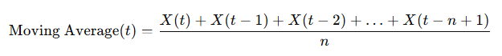

Where:
- X(t) is the value at time 𝑡.
- n is the size of the rolling window, meaning that each calculation will consider n consecutive data points.

This process helps in understanding the underlying patterns in the data by averaging out fluctuations over a specified period.

### 2. Attribute Construction
The **World Urban Population** attribute was constructed by summing the **Urban Population** for each country, grouped by **Year**. This provides a comprehensive view of urbanization trends on a global scale, allowing for better comparisons and analysis across different time periods.

### 3. Normalization
**Population and Urban Population:** Both attributes were normalized using **min-max normalization**, scaling their values to a range of 0 to 1. The formula for min-max normalization is:

**Formula:**

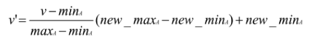

Where:
- v' is the normalized value.
- v is the original value.
- minA is the minimum value in the dataset.
- maxA is the maximum value in the dataset.
- new_minA is the new minimum (in our case is 0).
- new_maxA is the new maximum (in our case is 1).

This allows for better comparison across different scales and enhances the performance of machine learning algorithms.
  
**Median Age:** The **Median Age** attribute was normalized using **Z-score normalization**, which standardizes the values based on the mean and standard deviation. The formula for Z-score normalization is:

**Formula:**


Where:
- v' is the Z-score.
- v is the original value.
- μA is the mean of the dataset.
- σA is the standard deviation of the dataset.


This helps in identifying outliers and understanding the distribution of the data.

**Density:** The **Density** attribute was normalized using **Decimal Scaling normalization**, which adjusts the values based on the maximum absolute value. The formula for decimal scaling is:

**Formula:**

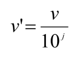

Where:
- v' is the normalized value.
- v is the original value.
- j is the smallest integer such that Max(|ν|) < 1

This technique ensures that the data is appropriately scaled for further analysis.

### 4. Discretization
The **Median Age** and **Yearly Change** attributes were discretized into bins using **bins by boundaries**. This technique converts continuous data into categorical data by dividing the data range into distinct intervals. The process can be illustrated with the following steps:

1. Define the boundaries for each bin.
2. Assign each value to the appropriate bin based on its range.

**Median Age Case:**
The boundaries for **Median Age** are defined as:
- 0-2 years: Baby
- 3-39 years: Young Adults
- 40-59 years: Middle-aged Adults
- 60+ years: Old Adults

**Yearly Change Case:**
The boundaries for **Yearly Change** are partitioned into equal-frequency and defined as:
- Low
- Medium
- High

The resulting categorical values would simplify the analysis and help in identifying patterns within specific ranges of values. Discretization can enhance the interpretability of the results by grouping similar values together.


## Skewness

### What is Skewness?
Skewness is a statistical measure that describes the asymmetry of a data distribution. It helps in understanding whether the data is symmetric, positively skewed (right-tailed), or negatively skewed (left-tailed). A perfectly symmetrical dataset has a skewness of 0. Positive skewness indicates a distribution with a longer tail on the right, while negative skewness indicates a longer tail on the left.

Understanding skewness is important for data analysis as it provides insights into the shape of the data distribution, helping analysts make decisions regarding transformations, modeling approaches, or potential biases in the dataset.

### Fields and Methodology
We calculated skewness, along with mean, median, and mode, for the following fields in our dataset:
- Annual Population Growth
- Migration Rate
- Density
- Fertility Rate
- Median Age
- Yearly Change

To compute skewness, we used the `scipy.stats` library in Python, which provides a convenient function called `skew`. Below is an example of the code used:

```python
from scipy.stats import skew
import statistics

# Example: Calculating skewness, mean, median, and mode for Annual Population Growth
annual_population_growth_skewness = skew(data['Annual_Population_Growth'], nan_policy='omit')
annual_population_growth_mean = statistics.mean(data['Annual_Population_Growth'])
annual_population_growth_median = statistics.median(data['Annual_Population_Growth'])
annual_population_growth_mode = statistics.mode(data['Annual_Population_Growth'])

print(f"Skewness for Annual Population Growth: {annual_population_growth_skewness}")
print(f"Mean: {annual_population_growth_mean}, Median: {annual_population_growth_median}, Mode: {annual_population_growth_mode}")
```

This code calculates skewness while handling missing values using the `nan_policy='omit'` parameter. Additionally, it computes the mean, median, and mode for a comprehensive understanding of the data distribution. The resulting values provide insights into the shape and spread of the data for each field.

### Results
Here are the results of skewness, mean, median, and mode calculations for each field, along with a brief description:

1. **Annual Population Growth**
   - Skewness Value: -0.51
   - Mean: -0.05
   - Median: -0.03
   - Mode: 0.00

This field’s distribution shows negative skewness, indicating that most countries experienced population growth slightly below average.
   
   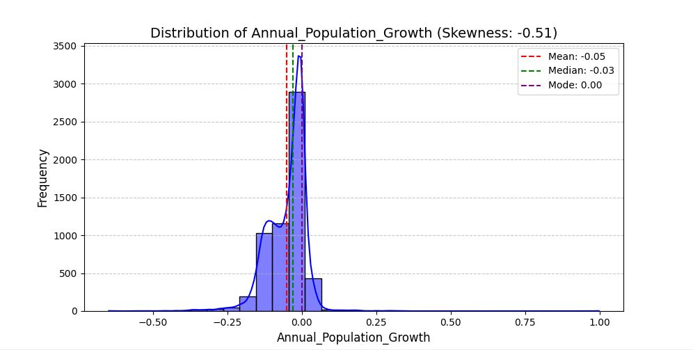
  

2. **Migration Rate**
   - Skewness Value: -6.37
   - Mean: -0.28
   - Median: 0.00
   - Mode: 0.00

The migration rate data exhibits negative skewness, suggesting that most countries experienced emigration, with a few having significant immigration rates.

   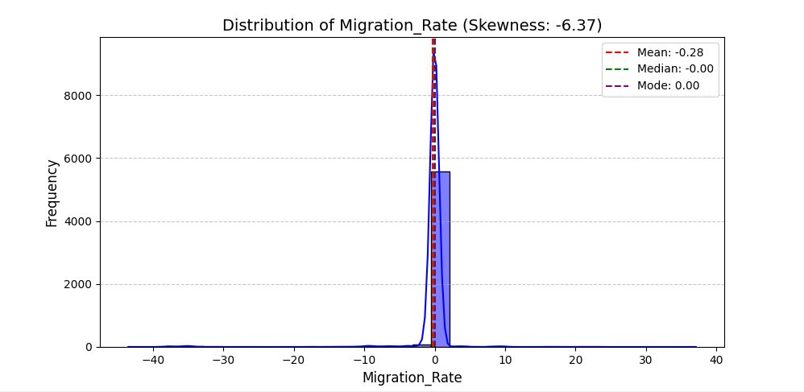

3. **Density**
   - Skewness Value: 10.54
   - Mean: 394.94
   - Median: 80.00
   - Mode: 4.00

The distribution of density is positively skewed, which means a few countries have extremely high population density compared to the majority.

   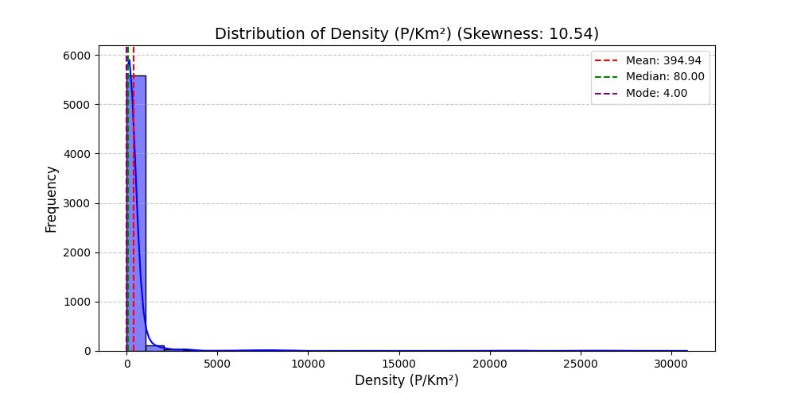

4. **Fertility Rate**
   - Skewness Value: 0.68
   - Mean: 3.47
   - Median: 2.90
   - Mode: 1.53

Fertility rate data shows positive skewness, reflecting that most countries have moderate fertility rates, with fewer having very high rates.

   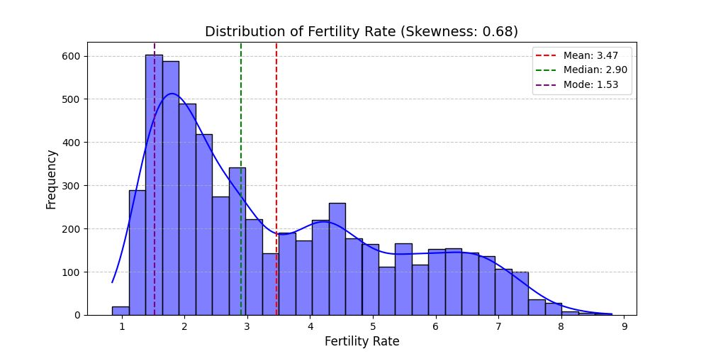

1. **Median Age**
   - Skewness Value: 0.53
   - Mean: 29.08
   - Median: 27.30
   - Mode: 27.20

Median age exhibits positive skewness, providing insights into younger populations dominating globally, with fewer older populations.

   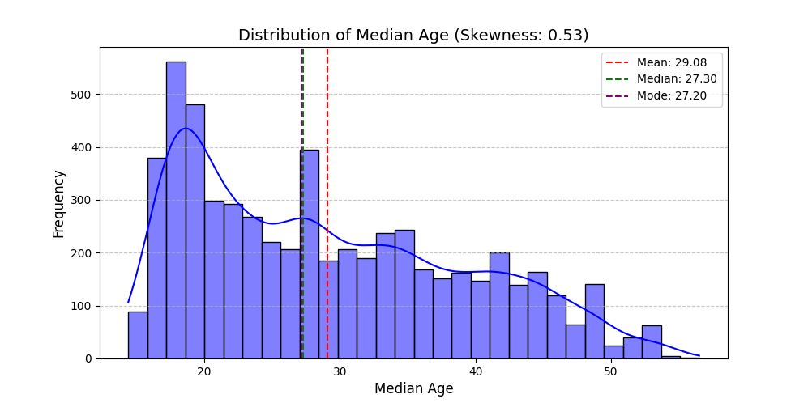

2. **Yearly Change**
   - Skewness Value: 9.72
   - Mean: 317551.59
   - Median: 30475.00
   - Mode: 0.00

The yearly change data has positive skewness, indicating that a few countries contribute to significant population increases compared to the majority.

   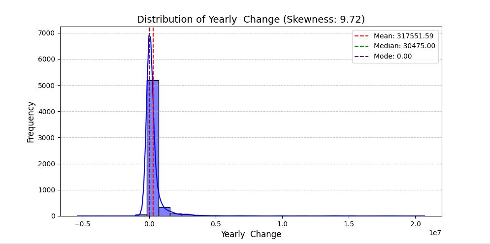


##  SMOTE ALGORITHM

### What is SMOTE Algorithm?
The Synthetic Minority Oversampling Technique (SMOTE) is a popular oversampling method used in machine learning to address class imbalance in datasets. It generates synthetic samples for the minority class by interpolating between existing data points rather than duplicating them.


### Fields and methodology
Selected Features: A subset of columns is chosen for analysis:
-Annual Population Growth
-Migration Rate
-Density (P/Km²)
-Fertility Rate
-Median Age
-Yearly Change

### Statistical Analysis
The script computes key statistical metrics for the selected features:

Range: The difference between the maximum and minimum values for each column.
Variance: A measure of data variability for each column.
Mode: The most frequently occurring value in each column.
Median: The middle value when data is ordered.
Here are the results:

Range of Columns:
Annual_Population_Growth    1.647051e+00
Migration_Rate              8.055322e+01
Density (P/Km²)             3.087400e+04
Fertility Rate              7.950000e+00
Median Age                  4.210000e+01
Yearly  Change              2.605790e+07
dtype: float64

Variance of Columns:
Annual_Population_Growth    4.447004e-03
Migration_Rate              1.218364e+01
Density (P/Km²)             4.109979e+06
Fertility Rate              3.354060e+00
Median Age                  1.003907e+02
Yearly  Change              1.541143e+12
dtype: float64

Mode of Columns:
Annual_Population_Growth     0.00
Migration_Rate               0.00
Density (P/Km²)              4.00
Fertility Rate               1.53
Median Age                  27.20
Yearly  Change               0.00
Name: 0, dtype: float64

Median of Columns:
Annual_Population_Growth       -0.029547
Migration_Rate                 -0.000388
Density (P/Km²)                80.000000
Yearly  Change              30475.000000
dtype: float64

The Synthetic Minority Oversampling Technique (SMOTE) is used to balance the dataset by generating synthetic samples for underrepresented classes:

Input Data (X): All features except the target columns.
Target (y): The Growth_Category column.

### Visualisations and results

1. **Dendsity**

Before SMOTE: Density values show high skewness (10.54), with most data concentrated near zero and minimal high-density values.
After SMOTE: Skewness increased (12.68), but SMOTE added synthetic data while maintaining the original distribution pattern.
Dot Plots: Highlight the added synthetic points, balancing density representation.

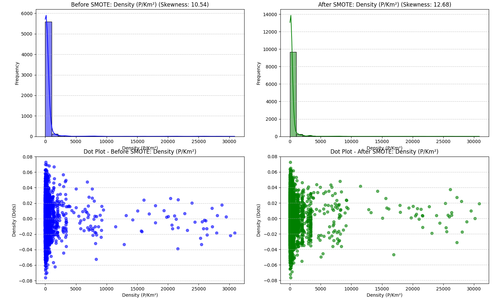

2. **Growth Category Distribution**

SMOTE balanced the dataset by equalizing the representation of growth categories, ensuring better suitability for machine learning.

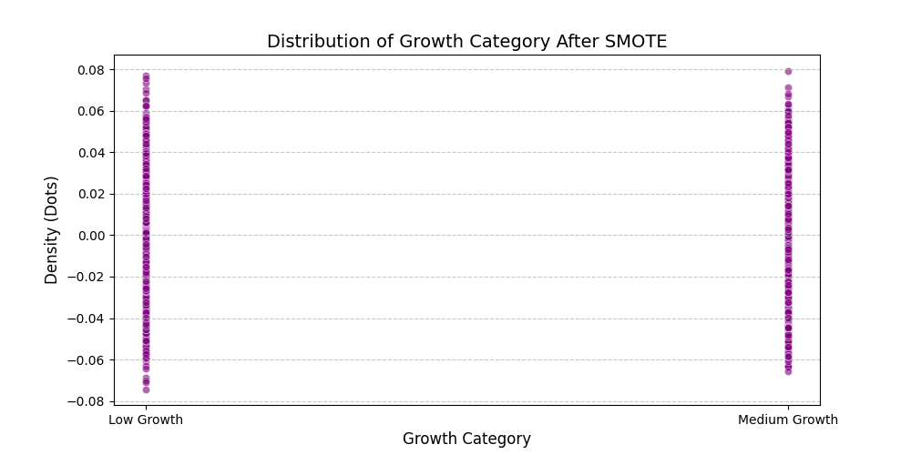

3. **Fertility Rate Distribution**

Before SMOTE: Fertility rates show moderate skewness (0.68), dominated by lower values.
After SMOTE: Skewness slightly increased (1.09), with synthetic data smoothing the distribution and improving balance.
Dot Plots: Demonstrate synthetic data filling underrepresented fertility ranges.

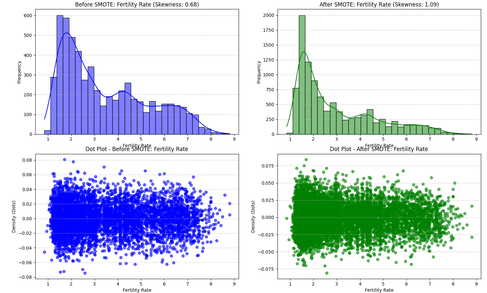

4. **Median**

Before SMOTE : The histogram shows a skewed distribution with a skewness value of 0.53. There is a higher frequency of values clustered toward the lower end (between 15 and 30), with fewer data points at higher values.
After SMOTE : After applying SMOTE, the distribution becomes more uniform, with a skewness value reduced to -0.02. This indicates a more balanced dataset.

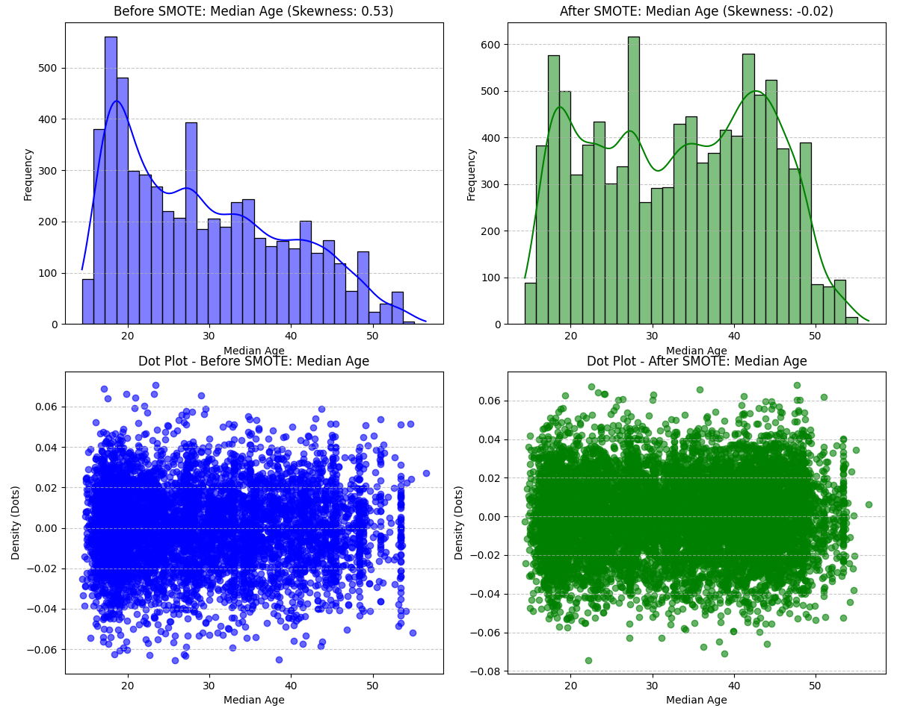

SMOTE successfully balances the distribution, removing skewness and ensuring an even spread across the range.

5. **Migration Rate**

Before SMOTE (Top-left): The histogram shows a highly skewed distribution with a skewness value of -6.37. Most values are concentrated around 0 with a sharp peak, while there are very few extreme negative and positive migration rates.
After SMOTE (Top-right): The skewness is slightly improved to -6.11 after SMOTE, but the distribution remains sharp near zero. While SMOTE generates some additional data, the extreme values still appear infrequent.


SMOTE provides slight improvements, though the extreme skewness remains due to the nature of the data.

5. **Yearly Change**

Before SMOTE - Histogram: The histogram shows a right-skewed distribution of "Yearly Change" with a skewness of 9.72. Most data points are concentrated near zero.

After SMOTE - Histogram: The histogram after applying SMOTE still shows a right-skewed distribution with a higher skewness of 12.26. Data remains highly concentrated near zero.

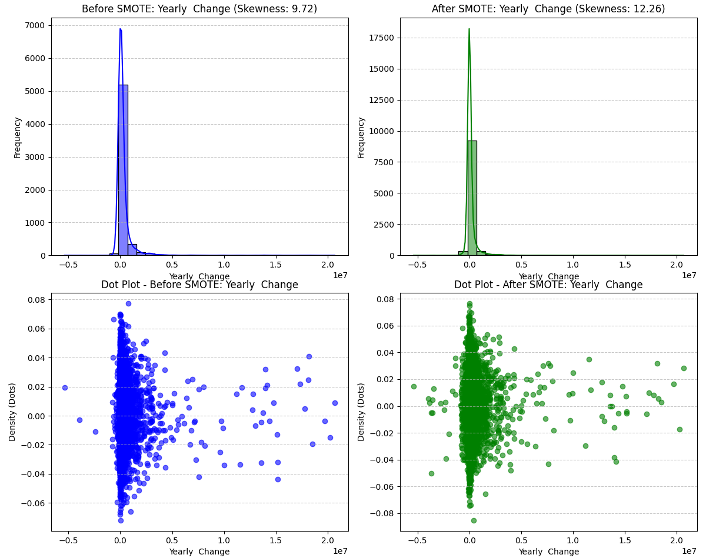


Conclusion:
The analysis demonstrates the effectiveness of SMOTE in addressing class imbalances and improving data distribution. By adding synthetic samples, SMOTE balances underrepresented categories (e.g., Growth Categories) and enhances data coverage for features like Density and Fertility Rate. While the skewness slightly increases, the overall data structure and patterns remain consistent, making the dataset more suitable for training machine learning models. This balanced representation is critical for reducing bias and improving model accuracy when predicting outcomes.

## Similarity & Dissimilarity


In data science, similarity and dissimilarity measures are used to compare datasets or individual data points. Similarity quantifies how alike two objects are, while dissimilarity quantifies how different they are. These measures are crucial in clustering, classification, and various machine learning algorithms.

We utilized the following methods to assess similarity and dissimilarity:

- Euclidean Distance
- Minkowski Distance
- Jaccard Index
- Jaccard Dissimilarity
- Simple Matching Coefficient (SMC)

### Methodology and Results

#### Euclidean Distance

The Euclidean distance measures the straight-line distance between two points in a multidimensional space. It is defined as:

   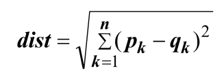

- **Field Used:** Population
- **Result:** Euclidean distance between the selected points is **1483205.0**.

#### Minkowski Distance

The Minkowski distance generalizes the Euclidean and Manhattan distances. It is defined as:

   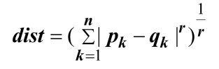

- **Field Used:** Median Age
- **Result:** Minkowski distance (p = 3) between the selected points is **1.1999999999999993**.

#### Jaccard Index

The Jaccard index measures similarity between two sets, defined as the size of the intersection divided by the size of the union:

   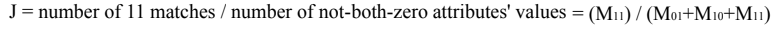

- **Fields Used:** Annual Population Growth, Migrants
- **Result:** Jaccard index is **0.07253494522100491**.

#### Jaccard Dissimilarity

Jaccard dissimilarity is the complement of the Jaccard index:

\[ D(A, B) = 1 - J(A, B) \]

- **Fields Used:** Annual Population Growth, Migrants
- **Result:** Jaccard dissimilarity is **0.9274650547789951**.

#### Simple Matching Coefficient (SMC)

SMC measures similarity between two binary data points. It is defined as:

   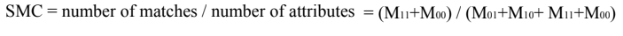

Where:
- \( a \): Number of matching 1-1 pairs
- \( d \): Number of matching 0-0 pairs
- \( b \): Number of 1-0 pairs
- \( c \): Number of 0-1 pairs

- **Fields Used:** Annual Population Growth, Migrants
- **Result:** SMC is **0.5796952576613593**.

### Conclusion

Similarity and dissimilarity measures provide essential insights for understanding relationships in the data. By leveraging these methods, we can better interpret patterns and make informed decisions in subsequent analyses.


### Multivariate Analysis

## Overview
The multivariate analysis examines relationships and patterns among multiple variables in the dataset using advanced statistical and machine learning techniques.


1. **Statistical Analys**
Statistical Analysis:

Calculated Range, Mean, Median, Variance, and Standard Deviation to summarize the features.
Observed significant variability in population-related attributes, such as Population, Urban Population, and Density.

Population and Urbanization:

Features like Population, Urban Population, and World Population exhibit high variability (large ranges and variances), reflecting significant differences between countries and years.
Urbanization levels (Urban Pop %) have a moderate spread, indicating uneven but ongoing urban population growth globally.
Demographic Trends:

Median Age and Fertility Rate show an inverse relationship, aligning with trends where regions with higher fertility rates tend to have a younger population.
Dependency Ratio highlights the economic challenges of regions with imbalanced working-age and dependent populations.
Migration Patterns:

Large variability in Migrants (net) and Migration Rate suggests substantial differences in migration trends, with extreme highs and lows across regions and years.
These patterns emphasize global migration as both a challenge and an opportunity for policy and infrastructure planning.
Statistical Observations:

High variance in features like Yearly Change and 3_Year_Pop_Avg showcases dynamic population changes over time, influenced by growth rates, urbanization, and migration factors.


2. **Correlation Analysis**

A Correlation Heatmap revealed strong relationships between variables like Population ↔ Urban Population and World Population.
Negative correlation between Fertility Rate and Median Age highlights global demographic trends.

Methodology:
A correlation matrix was computed to examine relationships between features.
A heatmap was generated to visualize these correlations.
Insights:
Strong positive correlations were observed between:
Population ↔ Urban Population
Population ↔ World Population
Negative correlation was noted between Fertility Rate and Median Age, consistent with global demographic trends.

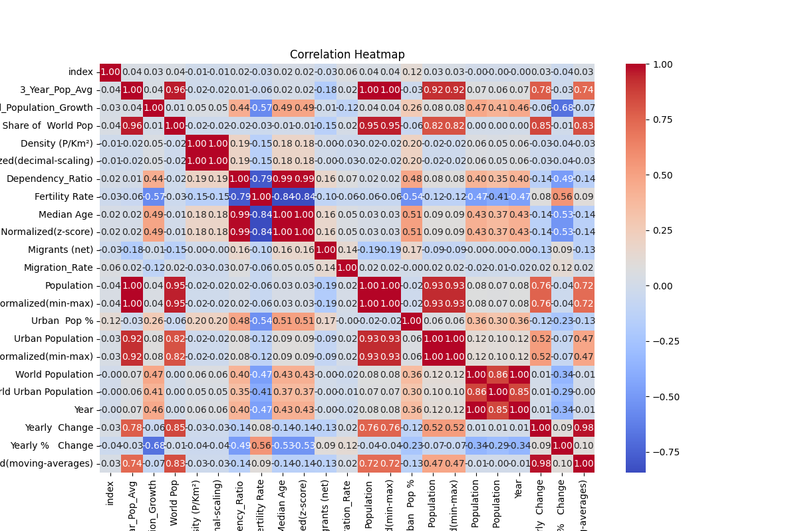

----
3. **Principal Component Analysis (PCA)**

methodology: 
Reduced dimensionality to 3 principal components while retaining most of the variance.
Visualized the first two components for insights into feature contributions.

Findings:
The first two components explained a significant portion of the variance in the dataset.
A PCA scatter plot visualized the first two principal components.

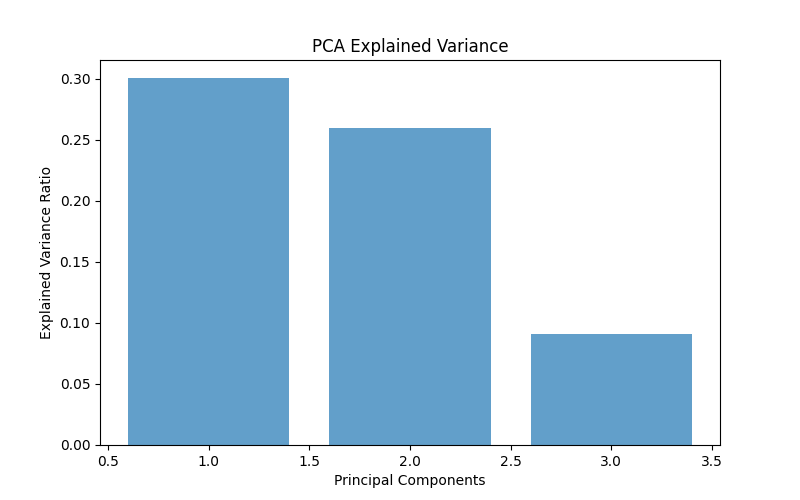


4. **K-Means Clustering**

Used the Elbow Method to identify the optimal number of clusters (4 clusters).
Countries were grouped based on demographic similarities, uncovering patterns in population size, growth rates, and urbanization.
Findings:
Silhouette Score for clustering: [insert computed silhouette score here].
The clustering results aligned well with the PCA scatter plot, highlighting distinct demographic groups.


3. **Pair Plot Analys**
Overview:
A pair plot was generated to visually explore the relationships and distributions of the dataset features. This visualization helps identify correlations, trends, outliers, and clustering behavior.

Key Observations:
Feature Distributions:

The diagonal plots in the pair plot reveal that features like Population and Urban Population are highly skewed, with a small number of countries accounting for a significant portion of the values.
Urban Population Percentage (Urban Pop %) exhibits a moderately spread distribution, indicating varying levels of urbanization across countries.
Correlations:

Strong positive correlations are evident between Population ↔ Urban Population and Population ↔ World Population, reinforcing the findings from the correlation heatmap.
A negative relationship between Fertility Rate and Median Age is noticeable, consistent with global demographic trends.
Clusters:

The scatter plots show clear clusters, particularly when analyzing Population ↔ Urban Population. These clusters may correspond to distinct country groupings based on population and urbanization levels.
This clustering aligns with the K-Means Clustering results, suggesting four major demographic groups.


###### Contributors

- **Egzona Maloku** - *Contributor*  
- **Redon Osmanollaj** - *Contributor*  
- **Rukije Morina** - *Contributor* 
---

**University of Prishtina "Hasan Prishtina"**  
Faculty of Electrical and Computer Engineering (FIEK)  
Course: Artificial Intelligence  


