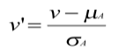

# Global Population and Forecast Analysis

This project combines historical and forecasted population data for different countries, to analyze trends like population growth, urbanization, demographic changes, and migration.

## Key Features

### Historical vs. Forecasted Data:
Each row is labeled as either "Historical" or "Forecasted" to help compare past data with future predictions.

### Types of Analysis:

- **Population Growth**: Compare how population growth (percentage change and absolute numbers) evolved in the past vs. predictions for the future.
- **Urbanization**: Analyze how urban populations have grown historically and what is projected for the future.
- **Demographic Shifts**: Examine changes in median age, fertility rates, and other factors over time.
- **Migration Peaks and Declines**: Look for years with significant migration spikes or drops.
- **Future Projections**: Analyze which regions are predicted to see major migration changes in the coming years.

## Visualizing Trends:
Use charts (e.g., line charts, bar charts) to visualize trends from 1950 to 2040, comparing past data with future projections.

&nbsp;

## Data Quality

A quality assessment of the world population and forecast dataset to ensure reliability and usability for analysis and visualization tasks.

### Accuracy

The evaluation of the dataset revealed several accuracy concerns:

- **Comparison with World Bank Data:** A comparison was performed between our dataset and the World Bank dataset for 10 selected countries over 8 years (from 1960 to 2020, increasing by 10 years). The results of this comparison showed:
  - **Total Population:** Our dataset differs by **2.08%** from the World Bank figures.
  - **Urban Population:** The difference is **2.36%** compared to World Bank data.

While the dataset provides a close approximation of population statistics, the percentage differences highlight areas for improvement in accuracy. Further validation from authoritative sources is recommended to enhance the dataset's reliability.

### Completeness

The completeness assessment of the dataset identified significant gaps in data availability:

- **Missing Countries:** The dataset does not include certain countries, such as Kosovo, and fails to adequately represent some small territories and islands  that are part of other countries like Vatican, Ivory Coast, Cabo Verde, Guernsey, Svalbard and Jan Mayen, Christmas Island, Antarctica, and Norfolk Island.
- **Migrants (net):** There are **1016 missing or empty values**.
- **Median Age:** There are **816 missing or empty values**.
- **Fertility Rate:** There are **816 missing or empty values**.

These missing values indicate a lack of comprehensive data for various countries, which could limit the effectiveness of analyses that rely on these critical demographic indicators. However, the omission of small territories and islands (except for Kosovo) is less impactful, as they are either very small or part of other countries.

### Timeliness

The timeliness of the dataset is a positive aspect, as it contains world population data that is readily accessible online. This ensures that users can obtain the most current and relevant information when needed. The dataset is designed to reflect ongoing demographic changes, allowing for timely analysis and insights into population trends. Given the dynamic nature of population data, the availability of this information supports informed decision-making and enhances the dataset's overall usability. Regular updates and access to real-time data are essential for maintaining its relevance and effectiveness in research and analysis.

### Believability

The dataset's believability is significantly enhanced by its source, Worldometer, which is known for its commitment to providing accurate and timely global statistics. Worldometer operates independently, without political, governmental, or corporate affiliations, ensuring an unbiased representation of data. It is run by an international team of developers, researchers, and volunteers dedicated to making world statistics accessible to a broad audience.

Worldometer has garnered recognition as a trusted authority in the field of statistics, being voted one of the best free reference websites by the American Library Association (ALA). Its data is relied upon by various reputable entities, including the UK Government, Johns Hopkins CSSE, and multiple international organizations. Over the past 15 years, Worldometer’s statistics have been cited in over 10,000 published books and more than 25,000 professional journal articles, further attesting to its credibility.

The dataset obtained from Kaggle was scraped from Worldometer using an open-source Python script, which allows for transparency regarding data collection methods. Given the robust reputation of Worldometer and its extensive use by respected institutions, the dataset can be considered a reliable source for demographic analysis and insights.

### Interpretability

The dataset is highly interpretable, characterized by its clear structure and user-friendly presentation. The organization of data allows for straightforward navigation, making it easy for users to understand the various demographic metrics presented. Columns are clearly labeled, and the data types are consistent, facilitating quick comprehension of the information.

## Data Processing Workflow

The following steps outline the data processing, type conversions, and cleaning operations performed on the dataset.

### 1. Data Loading

Data is loaded from the `original_dataset.csv` file, with the columns verified before proceeding.

### 2. Data Type Conversion

To ensure consistency, appropriate data types were assigned to specific columns:

- **Integer Columns**:
  - `Population`
  - `Year`
  - `Yearly Change`
  - `Density (P/Km²)`
  - `World Population`
  - `Rank`

- **Float Columns**:
  - `Yearly % Change`: Cleaned by removing `%` symbols and converted to decimal format (e.g., `1.30%` becomes `0.013`).
  - `Urban Pop %`: Cleaned similarly by removing `%` symbols and converting to decimal.
  - `Country's Share of World Pop`: Cleaned by removing `%` symbols and converted to decimal.
  - `Migrants (net)`
  - `Median Age`
  - `Fertility Rate`
  - `Urban Population`

- **String Columns**:
  - `country`
  - `DataType`

### 3. Data Cleaning

To prepare the dataset for analysis, several cleaning operations were performed:

1. **Remove Symbols**: In columns like `Yearly % Change`, `Urban Pop %`, and `Country's Share of World Pop`, `%` symbols were removed, and the values were converted to decimal format.
2. **Handle Missing Values**: Placeholder values like `"N.A."` and empty strings were replaced with `NaN`, allowing for consistent handling of missing values across the dataset.
3. **Replace Empty Strings with NaN**: For columns that may have contained empty strings or spaces (e.g., `Migrants (net)`, `Median Age`, `Fertility Rate`, and `Urban Population`), these were replaced with `NaN` to ensure uniformity in missing value treatment.

### 4. Duplicate Removal

Duplicates were identified and removed based on the `country`, `DataType` and `Year` columns, ensuring unique time-series data for each country. This process helps prevent duplication in historical and forecasted data analysis.

### 5. Missing Value Handling

Missing values were addressed as follows:

1. **Country and DataType Level**: Median values were calculated for each column by grouping by `country` and `DataType` to avoid mixing "Historical" and "Forecasted" data.
2. **Urban Population Estimate**: For entries where `Urban Population` was missing, values were estimated by calculating `Population * Urban Pop %`.
3. **Forward and Backward Fill**: Missing values within each `country` and `DataType` group were forward- and backward-filled for columns where this approach was feasible.

### 6. Data Aggregation 
#### Region-Level Aggregation

Aggregates data by `Region`, `Year`, and `DataType` to compare historical and forecasted trends across regions.

**Example Output:**
| Region | Year | DataType   | Population | Yearly % Change | Migrants (net) | Urban Population |
|--------|------|------------|------------|-----------------|----------------|------------------|
| Asia   | 2020 | Historical | 4,647,000  | 0.01            | -100,000       | 2,560,000       |
| Europe | 2020 | Forecasted | 747,000    | -0.01           | -10,000        | 550,000         |

### 7.Sampling

Sampling is used to select a representative subset of data, ensuring a balance between Historical and Forecasted records, which aids in effective and manageable analysis.

**Sampling Method:**
- **Equal Sampling by DataType**: Randomly selects an equal number of Historical and Forecasted records (e.g., 50 each) to create a balanced sample.

**Example Output:**
| country    | Year | Population | DataType   |
|------------|------|------------|------------|
| Albania    | 2017 | 2,876,664  | Historical |
| Albania    | 2035 | 424,537    | Forecasted |

### 8.Sampling
Key correlations are done in a population dataset to support dimensionality reduction decisions.

## Steps

1. **Correlation Analysis**: 
   - Calculated correlations between:
     - **Urban Pop %** and **Urban Population**
          ***Interpretation**: The low correlation indicates that `Urban Pop %` and `Urban Population` capture different aspects of urbanization. Both metrics may provide unique insights, so retaining both variables is recommended.

     - **Yearly % Change** and **Yearly Change**
          ***Interpretation**: Similarly, the low correlation suggests that `Yearly % Change` and `Yearly Change` measure distinct aspects of annual population trends. Including both variables may yield a more comprehensive view of these trends.
          
2. **Rank Column Assessment**: 
   - Evaluated the `Rank` column's correlation with other features. Due to its low relevance, `Rank` was removed.

### 9.Feature Subset Selection**
This process reduces the dataset to a meaningful subset of features by removing redundant and irrelevant columns.

- **remove_redundant_features:**

- **Technique Used: Filter-Based Technique.**
Method: Identifies and removes redundant features based on correlation. A correlation threshold of 0.9 is set, and features exceeding this threshold are considered redundant and removed. This step prevents multicollinearity in the dataset, which can interfere with analysis.

- **remove_irrelevant_features:**
Technique Used: Wrapper-Based Technique.
Method: Removes columns deemed irrelevant to the analysis based on domain knowledge. This process ensures that only features relevant to the analysis goals are included, reducing noise in the data.

- **feature_selection:**
Technique Used: Wrapper-Based Technique (Manual Feature Selection).
Method: Selects a subset of key features for analysis, including country, Year, Population, Fertility Rate, Urban Pop %, Migrants (net), Median Age, Density (P/Km²), and DataType. Missing values are handled by filling them with zeros to ensure a complete dataset.

**Feature Engineering**
This step creates new features from the original data to enhance the analysis.

- **feature_engineering:**
Techniques Used: Domain-Specific Feature Engineering and Rolling Window Calculations.
New Features:
- **Annual_Population_Growth: Calculates the yearly population growth rate per country using the percentage change in population.**
- **Migration_Rate:** Computes the migration rate as a percentage of the total population.
- **Age_Category**: Categorizes each country’s population as 'Young,' 'Middle-Aged,' or 'Aging' bas
ed on Median Age.
- **3_Year_Pop_Avg:** Calculates a rolling three-year average for the population per country.

**Example Output**

| country | Year | Population | Annual_Population_Growth | Migration_Rate | Age_Category | 3_Year_Pop_Avg |
|---------|------|------------|--------------------------|----------------|--------------|-----------------|
| Albania | 2045 | 2533645    | 0.045206783              | -0.003157506   | Aging        | 2478853         |
| Albania | 2040 | 2634384    | 0.039760503              | -0.003036763   | Aging        | 2530696.667     |
| Albania | 2035 | 2721082    | 0.03291016               | -0.002940007   | Aging        | 2629703.667     |
| Albania | 2030 | 2786974    | 0.024215367              | -0.003946933   | Aging        | 2714146.667     |
| Albania | 2025 | 2840464    | 0.019192859              | -0.004928772   | Middle-Aged  | 2782840         |

## Data Transformation

This section outlines the data transformation techniques applied to the dataset for improving data quality and preparing it for analysis. The transformations include smoothing, attribute construction, normalization, and discretization to enhance interpretability and usability.

### 1. Smoothing
The **Yearly Change** attribute was smoothed using moving averages to reduce noise and provide a clearer trend. The moving average is calculated as follows:

**Formula:**

Where:
- X(t) is the value at time 𝑡.
- n is the size of the rolling window, meaning that each calculation will consider n consecutive data points.

This process helps in understanding the underlying patterns in the data by averaging out fluctuations over a specified period.

### 2. Attribute Construction
The **World Urban Population** attribute was constructed by summing the **Urban Population** for each country, grouped by **Year**. This provides a comprehensive view of urbanization trends on a global scale, allowing for better comparisons and analysis across different time periods.

### 3. Normalization
**Population and Urban Population:** Both attributes were normalized using **min-max normalization**, scaling their values to a range of 0 to 1. The formula for min-max normalization is:

**Formula:**

Where:
- v' is the normalized value.
- v is the original value.
- minA is the minimum value in the dataset.
- maxA is the maximum value in the dataset.
- new_minA is the new minimum (in our case is 0).
- new_maxA is the new maximum (in our case is 1).

This allows for better comparison across different scales and enhances the performance of machine learning algorithms.
  
**Median Age:** The **Median Age** attribute was normalized using **Z-score normalization**, which standardizes the values based on the mean and standard deviation. The formula for Z-score normalization is:

**Formula:**

Where:
- v' is the Z-score.
- v is the original value.
- μA is the mean of the dataset.
- σA is the standard deviation of the dataset.

This helps in identifying outliers and understanding the distribution of the data.

**Density:** The **Density** attribute was normalized using **Decimal Scaling normalization**, which adjusts the values based on the maximum absolute value. The formula for decimal scaling is:

**Formula:**

Where:
- v' is the normalized value.
- v is the original value.
- j is the smallest integer such that Max(|ν|) < 1

This technique ensures that the data is appropriately scaled for further analysis.

### 4. Discretization
The **Median Age** and **Yearly Change** attributes were discretized into bins using **bins by boundaries**. This technique converts continuous data into categorical data by dividing the data range into distinct intervals. The process can be illustrated with the following steps:

1. Define the boundaries for each bin.
2. Assign each value to the appropriate bin based on its range.

**Median Age Case:**
The boundaries for **Median Age** are defined as:
- 0-2 years: Baby
- 3-39 years: Young Adults
- 40-59 years: Middle-aged Adults
- 60+ years: Old Adults

**Yearly Change Case:**
The boundaries for **Yearly Change** are partitioned into equal-frequency and defined as:
- Low
- Medium
- High

The resulting categorical values would simplify the analysis and help in identifying patterns within specific ranges of values. Discretization can enhance the interpretability of the results by grouping similar values together.
